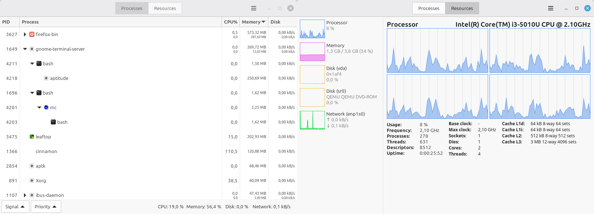

# Leaftop

A graphical [top](https://en.wikipedia.org/wiki/Top_(software))-style Linux system monitor program with simple process tree grouping and additional system statistics.

Made with plain GTK 4 (no libadwaita).

## Screenshot



## Building

Install prerequisites
```sh
sudo apt install meson valac libgtk-4-dev libgee-0.8-dev libgudev-1.0-dev gettext desktop-file-utils
```
Build
```sh
meson setup build
ninja -C build
```
Optionally install to system (/usr/local)
```sh
sudo ninja -C build install
```
