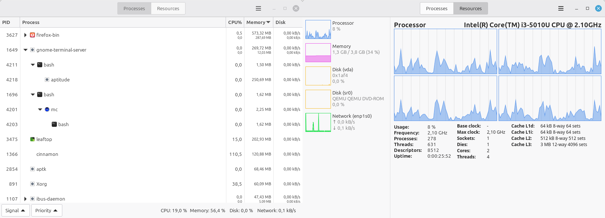

# Leaftop

A graphical [top](https://en.wikipedia.org/wiki/Top_(software))-style Linux system monitor program with simple process tree grouping and additional system statistics.

Made with plain GTK 4 (no libadwaita).

## Features

- Process table with better grouping
  - Simple groups (processes under known launchers), flat list, full tree, by CGroup
- Resources page with graphs and some useful details, network and disk stats split by device
- Setting process priority, scheduling options (WIP)
- Detailed process information, open files, network connections (WIP)
- Per-process network usage (WIP)

## Screenshot



## Download

Debian/Ubuntu/Mint packages as well as generic tarballs can be downloaded from [Releases](https://github.com/slowscript/leaftop/releases) page (under Assets)

## Building

Install prerequisites
```sh
sudo apt install meson valac libgtk-4-dev libgee-0.8-dev libgudev-1.0-dev gettext desktop-file-utils
```
Build
```sh
meson setup build
ninja -C build
```
Optionally install to system (/usr/local)
```sh
sudo ninja -C build install
```
